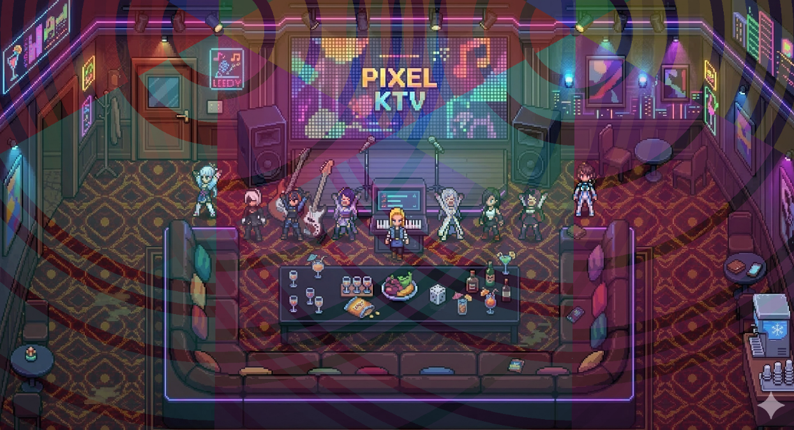

# Droi-game-tool - Video to Frames · Matte · Sprite Sheet **V3**

[中文](README.md) | [English](README.en.md) | [日本語](README.ja.md)

Pixel image and frame sequence toolset: video frame extraction, GIF processing, image matting, sprite sheet composition, and more.



## What's New in V3

- **Global shortcuts (home / in-feature)**: On home, **C** opens GIF↔Frames, **V** Pixel Image Processing, **G** Gemini watermark removal, **R** RoninPro → **Custom Scale**, **N** RoninPro → **Sheet Pro** (split + sprite sheet adjust); from any main feature, **B** returns home (ignored when an input/textarea/contenteditable is focused or with Ctrl/Cmd/Alt). See **Web Shortcuts** below.
- **RoninPro**: Custom scale, custom slice, unify size, and more; NFT gate is controlled by `RONIN_PRO_REQUIRE_NFT` in `frontend/src/config/features.ts` (default: no NFT required); **R** deep-links to Custom Scale; **N** deep-links to Sheet Pro.
- **Sheet Pro** (RoninPro, shortcut **N**): On **uniform grid**, **N×M** only defines how the full image is split (changing it re-splits). The preview **column count** only controls frames per row and the merge/export layout—it does **not** re-split the source. Also: grid split, transparency-gap split, optional pre-process, per-frame nudge and edge crop, merge, ZIP / GIF export.
- **Home layout**: RoninPro row is placed **above** Seedance watermark removal and asset/source sharing.
- **GIF ↔ Frames**: Default tab is **multi-image merge to single**; default input mode is **split single image** (grid split then merge).
- **Sprite Sheet Adjust**: Animation preview uses arrow buttons; **A / D** step through selected frames (when not typing); **recombine** exports sheet after per-frame offsets.
- **Control test scenes**: **Top-down** and **Arcade** demo scenes on the first home row.

## Features

### Video & Frames
- **Video to Frames**: Upload video, extract frames, rembg matte, generate Sprite Sheet
- **GIF ↔ Frames**: GIF extraction, frames to GIF, multi-image merge (default tab), split one image by grid then merge, single image split, simple stitch (vertical/horizontal)
- **Sprite Sheet**: Split frame images / Combine to GIF
- **Sprite Sheet Adjust**: Split preview, frame selection, animation preview (Ronin login required), frame navigation (buttons + **A/D**), recombine export after offsets

### Image Processing
- **Pixel Image Processing**: Dual entry
  - **Standard**: Scale, inner stroke, crop, matte (green/blue screen)
    - **RPGMAKER One-Click**: Remove Gemini watermark → contiguous matte from top-left (tolerance 80/feather 5) → 144×144 hard scale → RPGMAKER output
    - **RPGMAKER V2 One-Click (5 rows)**: Watermark → 256×256 hard scale → contiguous matte from first pixel → crop 64px right + 64px transparent bottom → rows 3–4 shifted down 64px, row 3 mirrored from row 2 → 5×3 grid, trim 8px per side per cell, merge → 144×240
    - **RPGMAKER V2 One-Click (4 rows)**: Same pipeline, then crop 48px from bottom → 144×192
    - **One-Image-All-Actions**: Remove Gemini watermark → 256×256 hard scale → top-left matte (tolerance 80) → crop 4px right/bottom → 252×252
    - **RPGMAKER Generate**: 3-row split, row 2 flip copy, row 3 shift 48px
  - **Fine Edit**: Brush, eraser, super eraser (connected region + tolerance), toggle bg color, undo (Ctrl+Z), zoom, pan
- **Chroma Key**: Green/blue screen removal, spill suppression, edge smooth
- **Pixelate**: Convert to pixel block style
- **Expand & Shrink**: N×M grid crop and merge
- **Gemini Watermark Removal**: Remove visible watermark from Gemini-generated images

### nanobanana (Ronin login required)
- **nanobanana RPG Maker Character**: Link to Gemini for RPG Maker character assets
- **nanobanana Pixel Scene** & **Standing Illustration**: Link to Gemini
- **nanob Full Character Action Test**: V4Tx3 continuous actions, etc.

### RoninPro (efficiency)
- **RoninPro** (Ronin login): **Custom Scale**, **Custom Slice**, **Unify Size**, **Sheet Pro**, etc. NFT requirement: see `frontend/src/config/features.ts`. In **Sheet Pro**, the split grid (N×M) and the preview/composite layout are separate: N/M re-cut the image; changing preview columns only reflows.

### Demo / experimental
- **Top-down Test Scene**, **Arcade Test Scene**: Control and layering experiments (not the main production pipeline).

### Other
- **Seedance 2.0 Video Watermark Removal**: Requires local backend. Remove "AI生成" from Seedance/Jiemeng videos
- **Assets & Game Source Share**: 01-Art assets, Godot scripts, finished projects (incl. AI Pixel Shop K)

### Web Shortcuts

- **V**: On the **home** screen, open **Pixel Image Processing** (entry picker; same focus/modifier rules as below).
- **R**: On the **home** screen, open **RoninPro → Custom Scale** (Ronin login required; NFT gate applies if enabled; same focus/modifier rules as below).
- **N**: On the **home** screen, open **RoninPro → Sheet Pro** (split + sprite sheet adjust; same login/NFT rules as **R**).
- **G**: On the **home** screen, open **Gemini Watermark Removal** (same focus/modifier rules as below).
- **C**: On the **home** screen, open **GIF ↔ Frames** (same as the card; same focus/modifier rules as below).
- **B**: Return to home from any main feature. Ignored while focus is in an input, textarea, or contenteditable; also ignored with Ctrl / Cmd / Alt (avoids browser shortcuts). The video workflow resets the upload step; the image module returns to its entry selection screen.

## Requirements

- Python 3.11+
- Node.js 18+
- Redis
- FFmpeg (in PATH)
- (Optional) Docker + Docker Compose

## Local Development

### 1. Install Dependencies

```bash
# Backend
pip install -r backend/requirements.txt

# Frontend
cd frontend && npm install
```

### 2. Start Redis

```bash
# Windows: Download Redis or use Docker
docker run -d -p 6379:6379 redis:7-alpine

# Or install and start Redis locally
```

### 3. Start Services

```bash
# Terminal 1: API
cd pixelwork
set PYTHONPATH=%CD%
python -m uvicorn backend.app.main:app --reload --port 8000

# Terminal 2: Worker
set PYTHONPATH=%CD%
rq worker pixelwork --url redis://localhost:6379/0

# Terminal 3: Frontend
cd frontend && npm run dev
```

Open http://localhost:5173

### 4. rembg / U2Net (Backend only)

The frontend uses chroma key for "Video to Frames" and does not require the model. For backend + Worker server-side matting, U2Net (~176MB) will be downloaded on first run.

## GitHub Pages Preview

The project uses GitHub Actions. Pushing to `main` triggers build and deploy to GitHub Pages.

**First-time setup: Enable Pages**

1. Open https://github.com/systemchester/FrameRonin/settings/pages
2. Under **Build and deployment**, set **Source** to **GitHub Actions**
3. Save. Future pushes to `main` will auto-deploy

**URL:** https://systemchester.github.io/FrameRonin/

> Note: Current deployment is frontend-only. GIF split/combine, pixel image processing (incl. fine edit), chroma key, simple stitch, Sprite Sheet, RPGMAKER one-click, and video-to-frames are all usable.

## Docker

```bash
docker-compose up -d
```

- Frontend: http://localhost:5173
- API: http://localhost:8000
- Redis: localhost:6379

## API

| Method | Path | Description |
|--------|------|-------------|
| POST | /jobs | Create task (upload video) |
| GET | /jobs/{id} | Get task status |
| GET | /jobs/{id}/result?format=png\|zip | Download result |
| GET | /jobs/{id}/index | Download index JSON |
| DELETE | /jobs/{id} | Delete task |

## Index JSON Example

```json
{
  "version": "1.0",
  "frame_size": {"w": 256, "h": 256},
  "sheet_size": {"w": 3072, "h": 2048},
  "frames": [
    {"i": 0, "x": 0, "y": 0, "w": 256, "h": 256, "t": 0.000},
    {"i": 1, "x": 256, "y": 0, "w": 256, "h": 256, "t": 0.083}
  ]
}
```

## Links

- **Bilibili**: https://space.bilibili.com/285760

## Docs

| Doc | Description |
|-----|-------------|
| [DEV_DOC_video2timesheet.md](./DEV_DOC_video2timesheet.md) | Video→frames / Sprite Sheet product & API design |
| [DEV_PLAN_extensions.md](./DEV_PLAN_extensions.md) | Extension plan & V3 shipped checklist |
| [DEPLOY.md](./DEPLOY.md) | Push, CNB/EdgeOne, deploy notes |
| [frontend/README.md](./frontend/README.md) | Frontend project notes |
