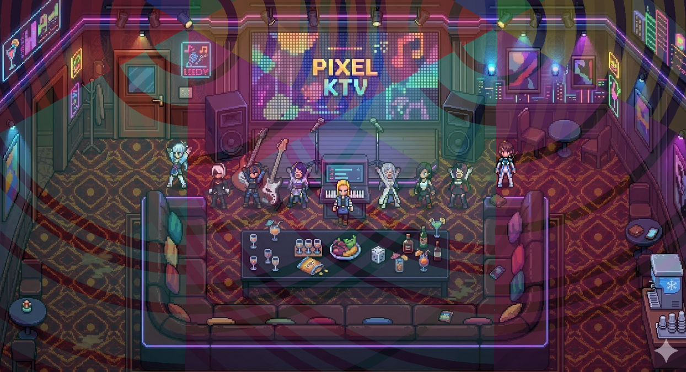

# FrameRonin - 動画→フレーム · マット · スプライトシート v2.5

[中文](README.md) | [English](README.en.md) | [日本語](README.ja.md)

ピクセル画像・フレームシーケンスツール集。動画フレーム抽出、GIF処理、画像マット、スプライトシート合成などに対応。



## 機能モジュール

### 動画とフレーム
- **動画→フレーム**：動画アップロード、フレーム抽出、rembgマット、スプライトシート生成
- **GIF ↔ フレーム**：GIF拆帧、フレーム→GIF、複数画像合成・分割、簡易ステッチ（上下/左右）
- **Sprite Sheet**：フレーム画像分割 / GIF合成
- **Sprite Sheet 調整**：分割プレビュー、フレーム選択、アニメプレビュー（Roninログイン要）

### 画像処理
- **ピクセル画像処理**：2つの入口
  - **通常処理**：スケール、内側ストローク、トリム、マット（グリーン/ブルーバック）
    - **RPGMAKER ワンクリック**：Gemini透かし除去 → 左上マット(容差80/羽化5) → 144×144 → RPGMAKER出力
    - **1枚全アクション**：Gemini透かし除去 → 256×256 → 左上マット(容差80) → 右/下4px裁断 → 252×252
    - **RPGMAKER 生成**：3行分割、2行目反転複製、3行目48px下移動
  - **精密編集**：ブラシ、消しゴム、スーパー消しゴム（連結領域+容差）、背景色切替、アンドゥ(Ctrl+Z)、ズーム、パン
- **クロマキー**：グリーン/ブルーバック除去、抑色、エッジ平滑
- **ピクセル化**：ピクセルブロックスタイルに変換
- **拡大・縮小**：N×Mグリッド裁断・結合
- **Gemini 透かし除去**：Gemini生成画像の透かしを除去

### nanobanana シリーズ（Roninログイン要）
- **nanobanana RPG Maker キャラ素材生成**：GeminiでRPG Makerキャラ素材生成
- **nanobanana ピクセルシーン**・**立ち絵生成**：Geminiリンク
- **nanob 全キャラアクション**：連生アクション V4Tx3 等

### その他
- **Seedance 2.0 動画透かし除去**：ローカルバックエンド要。Seedance/即梦動画の「AI生成」を除去
- **素材・ゲームソース共有**：01-美術素材、Godotスクリプト、完成プロジェクト（AIピクセルショップK含む）

## 環境要件

- Python 3.11+
- Node.js 18+
- Redis
- FFmpeg（PATHに配置）
- （任意）Docker + Docker Compose

## ローカル開発

### 1. 依存関係インストール

```bash
# バックエンド
pip install -r backend/requirements.txt

# フロントエンド
cd frontend && npm install
```

### 2. Redis 起動

```bash
# Windows: RedisダウンロードまたはDocker
docker run -d -p 6379:6379 redis:7-alpine

# またはローカルにRedisをインストール・起動
```

### 3. サービス起動

```bash
# ターミナル1: API
cd pixelwork
set PYTHONPATH=%CD%
python -m uvicorn backend.app.main:app --reload --port 8000

# ターミナル2: Worker
set PYTHONPATH=%CD%
rq worker pixelwork --url redis://localhost:6379/0

# ターミナル3: フロントエンド
cd frontend && npm run dev
```

http://localhost:5173 を開く

### 4. rembg / U2Net（バックエンドのみ）

「動画→フレーム」フロントはクロマキー使用のためモデル不要。バックエンド+Workerでサーバー側マットを行う場合、初回にU2Net（約176MB）をダウンロード。

## GitHub Pages プレビュー

GitHub Actionsで`main`へのプッシュ時に自動ビルド・デプロイ。

**初回：Pages有効化**

1. https://github.com/systemchester/FrameRonin/settings/pages を開く
2. **Build and deployment**で**Source**を**GitHub Actions**に
3. 保存。以降`main`プッシュで自動デプロイ

**URL:** https://systemchester.github.io/FrameRonin/

> 現在はフロントエンドのみデプロイ。GIF拆帧/合成、ピクセル画像処理（精密編集含む）、クロマキー、簡易ステッチ、Sprite Sheet、RPGMAKERワンクリック、動画→フレームが利用可能。

## Docker

```bash
docker-compose up -d
```

- フロント: http://localhost:5173
- API: http://localhost:8000
- Redis: localhost:6379

## API

| メソッド | パス | 説明 |
|----------|------|------|
| POST | /jobs | タスク作成（動画アップロード） |
| GET | /jobs/{id} | タスク状態取得 |
| GET | /jobs/{id}/result?format=png\|zip | 結果ダウンロード |
| GET | /jobs/{id}/index | インデックスJSON取得 |
| DELETE | /jobs/{id} | タスク削除 |

## インデックスJSON例

```json
{
  "version": "1.0",
  "frame_size": {"w": 256, "h": 256},
  "sheet_size": {"w": 3072, "h": 2048},
  "frames": [
    {"i": 0, "x": 0, "y": 0, "w": 256, "h": 256, "t": 0.000},
    {"i": 1, "x": 256, "y": 0, "w": 256, "h": 256, "t": 0.083}
  ]
}
```

## リンク

- **Bilibili**: https://space.bilibili.com/285760

## ドキュメント

[DEV_DOC_video2timesheet.md](./DEV_DOC_video2timesheet.md) を参照
